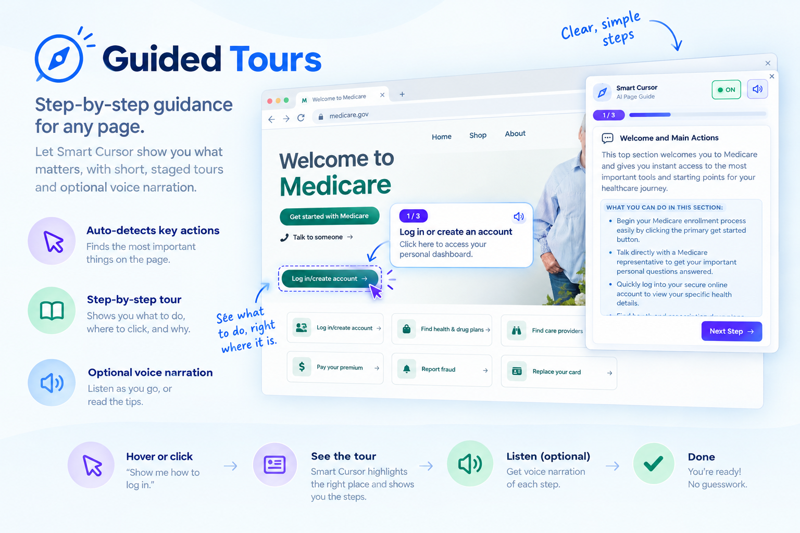
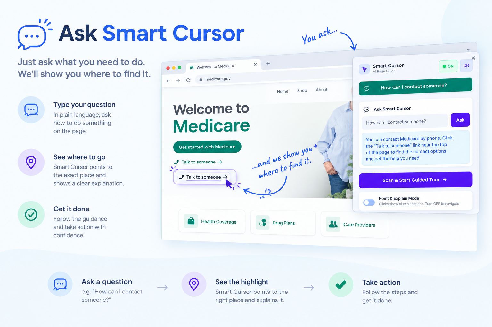
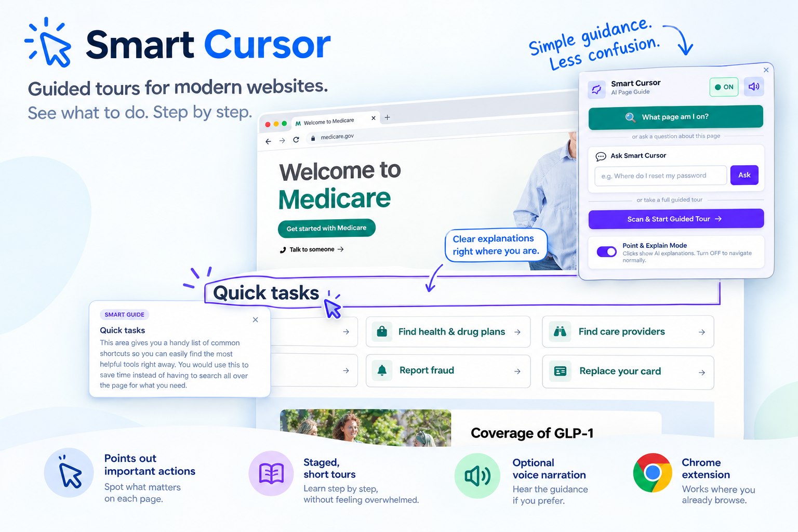

# Smart Cursor

Smart Cursor is a Chrome extension that helps people navigate confusing websites without feeling lost. It points at the important parts of a page, explains them in plain language, and guides users through a calm, structured tour instead of dumping a wall of technical text on them. It is designed especially for older adults and anyone who feels overwhelmed by unfamiliar interfaces.

<p align="center">
  
</p>

## Why this exists
Most AI tools on the web are built around a chat box. They tell you what a page is doing, but they do not help you find it or understand it in context. Smart Cursor takes a different approach: it reads the page, identifies the main sections and actions, and highlights the relevant elements while explaining them one idea at a time. That makes the experience feel more like a guided walkthrough than a generic chatbot.

## What it does

### Guided tours for confusing pages
Smart Cursor can build a simple, structured tour of a page and walk the user through the most important sections and actions without overwhelming them. The experience is paced to reduce mental load and to keep attention on one decision or one area at a time.

<p align="center">
  
</p>

### Risk warnings before important actions
When a page contains an action that may be risky or irreversible, Smart Cursor flags it clearly and adds a calmer, reassuring message so the user does not feel pushed into a bad decision. This helps people slow down and think before they act.

### Plain-language explanations and jargon help
The extension translates unfamiliar terms into plain language and surfaces definitions inline, so a person can understand what a button, label, or form field is for without needing to decode the site’s terminology.

### Ask Smart Cursor about a page
Users can ask a question about the currently loaded page, and the extension tries to answer using the page context instead of a generic AI response. It points at the relevant element or content area rather than only describing it in abstract text.

<p align="center">
  
</p>

### Voice narration for support and accessibility
Smart Cursor also supports voice narration. For a better-quality narration path, it can use a Neural2/TTS relay; if that is unavailable, it falls back to the browser’s built-in speech support so the feature still works without a full hosted deployment.

<p align="center">
  
</p>

## Local setup
This project is designed to run locally without requiring a deployed backend for the default path. The extension uses a local `.env` file and a generated config file for the Gemini API key.

1. Get a free Gemini API key: https://aistudio.google.com/
2. Copy the example env file and add your real key:

```bash
cp .env.example .env
# Edit .env and set:
# GEMINI_API_KEY=your_real_key_here
```

3. Generate the local config used by the extension:

```bash
npm run build
```

4. Load the extension in Chrome:

- Open `chrome://extensions/`
- Enable Developer mode
- Click `Load unpacked`
- Select this project folder
- Open any normal website and start using Smart Cursor

Notes:
- `npm run build` runs `build-config.js`, which reads `.env` and writes `config.local.js`.
- `.env` and `config.local.js` are git-ignored and should not be committed.
- The optional Cloudflare Worker in `relay/` remains available for a hosted or higher-quality Neural2 narration setup, but it is not required for the default local workflow.

## Project structure

```text
/
├─ background.js          # Chrome service worker: Gemini calls and message routing
├─ build-config.js        # Generates config.local.js from .env
├─ config.local.js        # Auto-generated local key file (gitignored)
├─ .env.example           # Example env file to copy
├─ .gitignore             # Ignores local secrets and generated config files
├─ manifest.json          # Chrome extension manifest
├─ content/               # Page content script: highlights, overlays, audio playback
├─ popup/                 # Popup UI and tour orchestration
├─ relay/                 # Optional Cloudflare Worker for hosted TTS/tour relay
├─ icons/                 # Extension icons
├─ images/                # Screenshots used in this README
├─ README.md              # Project introduction and setup
├─ LICENSE                # MIT license
└─ package.json           # Build script for the local config step
```

## Known limitations
- This extension is designed for regular DOM-based web pages and does not work on canvas-based apps such as Figma or similar editor interfaces.
- It cannot access cross-origin iframe content because of browser security restrictions.
- It does not click buttons or navigate the user around the site on their behalf; it highlights and explains the page instead.
- Neural2 voice narration depends on a compatible relay or audio endpoint; if it is not available, the browser speech fallback is used instead.

## Troubleshooting
- If the extension reports missing configuration, make sure `.env` exists and contains `GEMINI_API_KEY`, then run `npm run build` again.
- If narration falls back to browser speech, either accept that fallback or run the optional relay in `relay/` for better-quality Neural2 audio.
- If the page cannot be scanned, try a normal public website rather than `chrome://` or another internal browser page.

## License
This project is released under the MIT License. See the `LICENSE` file for details.